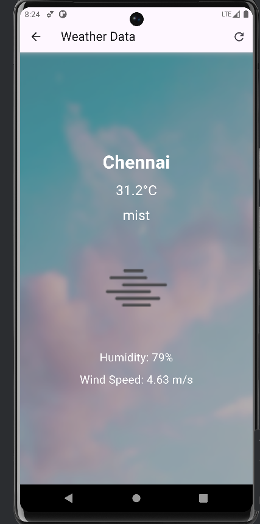

# Weather App

## Description
A weather application built with Flutter that integrates with the OpenWeatherMap API to display current weather conditions.

## Features
- Fetches current weather data using OpenWeatherMap API.
- Displays temperature, weather conditions, and location.
- Responsive design for mobile and web.

## Screenshots

1. 
2. 


## Installation
1. Clone the repository:
   ```bash
   git clone https://github.com/ganesh20060705/Weather_app.git
   
2. Navigate to the project directory:
    cd Weather_app

3. Install the dependencies:
    flutter pub get

## Usage
1.run the code:
    flutter run

2.The app will launch on your connected device or emulator.

## Configuration
1. Obtain an API key from OpenWeatherMap.
2. Create a .env file in the root directory and add your API key
    OPENWEATHERMAP_API_KEY=your_api_key_here

## Contributing

Contributions are welcome! Please follow these steps:

1. Fork the repository.
2. Create a new branch (`git checkout -b feature/your-feature-name`).
3. Make your changes.
4. Commit your changes (`git commit -am 'Add new feature'`).
5. Push to the branch (`git push origin feature/your-feature-name`).
6. Create a new Pull Request.

## Contact

For questions or support, please contact [ganesh20060705](https://github.com/ganesh20060705).
