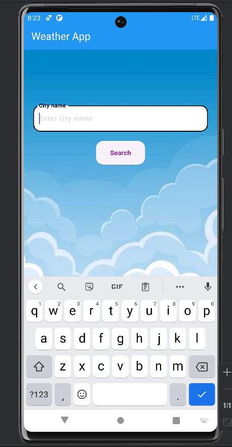

# Weather App

## Description
A weather application built with Flutter that integrates with the OpenWeatherMap API to display current weather conditions.

## Features
- Fetches current weather data using OpenWeatherMap API.
- Displays temperature, weather conditions, and location.
- Responsive design for mobile and web.

## Home Screen
Describe what the home screen of your weather application displays. You can mention:

Overview of the information shown (e.g., current weather, location, etc.).
Any interactive elements or navigation available on the home screen.

## Weather Screen
Detail what users can expect to see on the weather screen. Include:

Specific weather details provided (e.g., temperature, humidity, wind speed).
How users can interact with the weather data (e.g., refreshing data, switching locations).
Any unique features or visual elements specific to this screen.

## Screenshots

1. 
2. 


## Installation
1. Clone the repository:
   ```bash
   git clone https://github.com/ganesh20060705/Weather_app.git
   
2. Navigate to the project directory:
    cd Weather_app

3. Install the dependencies:
    flutter pub get

## Usage
1.run the code:
    flutter run

2.The app will launch on your connected device or emulator.

## Configuration
1. Obtain an API key from OpenWeatherMap.
2. Create a .env file in the root directory and add your API key
    OPENWEATHERMAP_API_KEY=your_api_key_here

## Contact

For questions or support, please contact [ganesh20060705](https://github.com/ganesh20060705).
